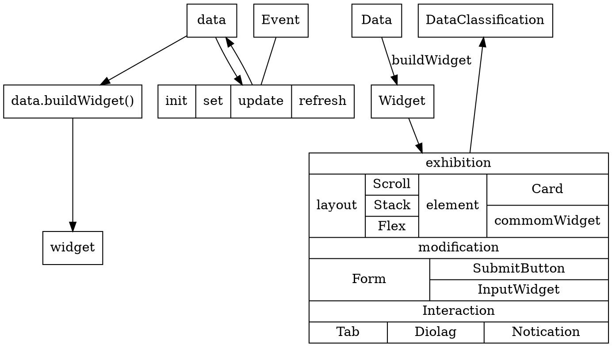
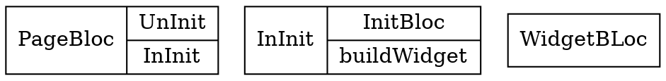

$$W(D) \rightarrow UI$$

> structure, ~~derived~~classification, transformation, relationship
> derived is classification

```dot
digraph{
    node[shape=record]
    data
        dataTransformation[label="init|set|update|refresh"]
        dataRelationship[label="data.buildWidget()"]
    // data->data[label="dataTransformation"]

    data->dataTransformation->data
    data->dataRelationship->widget
    Data
    Widget
        WidgetClassification[label="
        
        {exhibition|{layout|{Scroll|Stack|Flex}|element|{Card|commomWidget}}|modification|{Form|{SubmitButton|InputWidget}}|Interaction|{
            Tab|Diolag|Notication
        }}"]
        Widget->WidgetClassification->DataClassification
        {rank = same DataClassification Data}
    widget

    Data->Widget[label = "buildWidget"]

    // {rank = same Event,dataTransformation}
    Event->dataTransformation[dir=none ]
}
```

> InitPage
> 

```dot

digraph{
    node[shape=record]

    // Module
    PageBloc[label="PageBloc|{UnInit|InInit}"]

    InInit[label="InInit|{InitBloc|buildWidget}"]

    WidgetBLoc[]
}
```