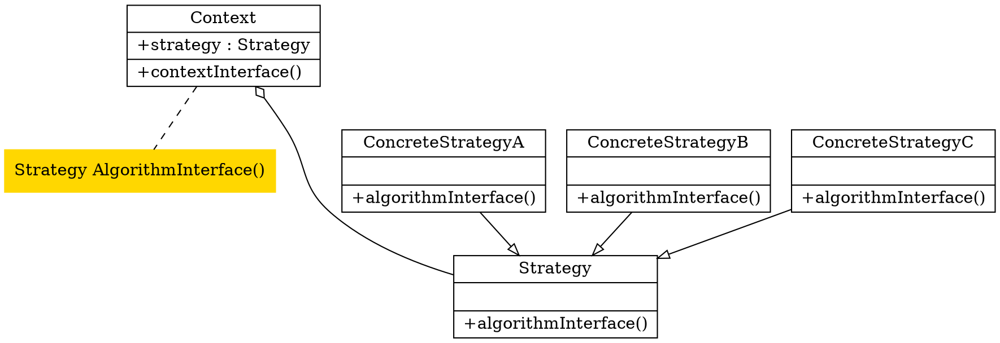
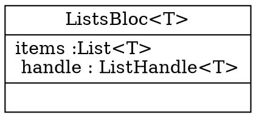
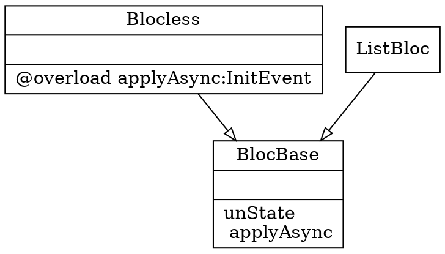

```dot
digraph G {    
    node[shape=record]    
    Context[label="{Context| +strategy : Strategy\l| +contextInterface()\l}"]
    Strategy[ label="{Strategy|\l|+algorithmInterface()\l}"]    
    
    ca[label="{ConcreteStrategyA|\l|+algorithmInterface()\l}"]
    cb[label="{ConcreteStrategyB|\l|+algorithmInterface()\l}"] 
    cc[label="{ConcreteStrategyC|\l|+algorithmInterface()\l}"]

    edge [ arrowhead="none", style="dashed"]
    Context->docs
    docs[
	  style="filled", color="gold",	label="Strategy AlgorithmInterface()"
	] 
        
    
    edge[
        arrowhead="odiamond", style="filled"
    ]
    Strategy -> Context  

    edge[ arrowhead="onormal", style="filled"]
    {rank=same;ca;cb;cc;docs}
    ca->Strategy   
    cb->Strategy  
    cc->Strategy 
}
```

```dot
digraph G {    
    node[shape=record]   

    ListsBloc[label="{ListsBloc\<T\>|
        items :List\<T\>\l
        handle : ListHandle\<T\>\l
    |
    }"]

    


}
```

```dot
digraph G {    
    node[shape=record]
    subgraph cluster0{
        label="Event"
        EventBase[label="{EventBase|props|applyAsync}"]
        InitEvent [label="{InitEvent\<T\>|param:T|}"]
        ResetEvent[label="{ResetEvent\<T\>|item:T|}"]
        PatchEvent[label="{PatchEvent||}"]
        DeriveEvent[label="{DeriveEvent||test}"]
        edge[ arrowhead="onormal", style="filled"]
        {InitEvent,ResetEvent,PatchEvent,DeriveEvent}->EventBase
    }

    subgraph cluster1{
        label="State"
        StateBase[label="{StateBase| |call}"]

        ModelState[label="{ModelState\<T\>|bean:T:ModelBase| }"]
        UnInitState[label="{UnInitState| |call()=\> DefaultCircularProgressIndicator()}"]
        InState[label="{InState| | }"]
        DeriveState[label="{DeriveState| params:Map| call() =\> dervice()}"]
        ListState[label="{ListState\<T\>|propss: List\<T\> | }"]

        edge[ arrowhead="onormal", style="filled"]

        {UnInitState,InState,DeriveState,ListState,ModelState}->StateBase
    }

    subgraph cluster2{
        label="ListBloc"
        ToStateable[label="{ToStateable| |modelToState(List\<T\> items)}"]
        StateBase[label="{StateBase| |call}"]

        ModelState[label="{ModelState\<T\>|bean:T:ModelBase| }"]
        UnInitState[label="{UnInitState| |call()=\> DefaultCircularProgressIndicator()}"]
        InState[label="{InState| | }"]
        DeriveState[label="{DeriveState| params:Map| call() =\> dervice()}"]
        ListState[label="{ListState\<T\>|propss: List\<T\> | }"]

        edge[ arrowhead="onormal", style="filled"]

        {Filter,Remove,FetchMore,InitOrRefresh}->ToStateable
        {Remove,FetchMore}->PatchEvent
        Filter->DeriveEvent
        InitOrRefresh->InitEvent

        ListStateImpl[label="{ListStateImpl\<T\>|
        items :List\<T\>\l
        hasReachedMax : bool\l
    |
    }"]

    FilterState[label="{FilterState\<T\>|
        items :List\<T\>\l
        hasReachedMax : bool\l
    |
    }"]

    edge[ arrowhead="onormal", style="filled"]
    FilterState->ListStateImpl
        
    }
    edge[arrowhead="odiamond",style="filled"]
    InState->{InitEvent}
    DeriveState->{DeriveEvent}

    edge[ arrowhead="onormal", style="filled"]
    UnItemState->UnInitState
    InItemState->InState

}
```

```dot
digraph G {    
    node[shape=record]
    BlocBase[label="{BlocBase| |unState \l applyAsync}"]
    Blocless [label="{Blocless||@overload applyAsync:InitEvent}"]
    
    edge[ arrowhead="onormal", style="filled"]
    {Blocless,ListBloc}->BlocBase

}
```