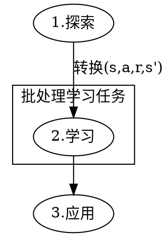
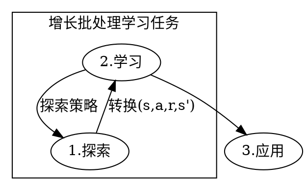

# 引言
假如,有一个家庭希望每一天比较高效,妻子会想准备好一顿好的早饭,她会早起,一边煮牛奶,一边煎鸡蛋.做完一切,看到孩子丈夫吃的开心,自己也很开心.

1. 强化学习[^强化学习]
在运筹学和控制文献中，强化学习被称为近似动态规划，或神经动态规划.其目的是让智能体学习一个最优或接近最优的策略，以最大化“奖励函数”或其他用户提供的从即时奖励中积累的强化信号.

<!-- 2. 批处理强化学习 -->

2.1. 批处理算法
批处理算法是指从一组固定的已知先验转移样本中学习最佳可能策略的任务.
特别强调在这个领域中开发出来,是为了,能很好的适应,学习器与环境不断交互进行学习.
* 批处理算法的特点包含以下两个:
1. 处理一批转换,并从中得成最佳转换.
2. 这个集合是不固定的

* 意味着的好处:
1. 所有观察到的转换在整个转换中同时的存储与更新,即拟合.
2. 允许定义“增长批处理”,最大程序减少了批处理和在线学习方法之间的差异.

2.2.1. 批处理学习问题
批处理学习问题中,学习器本身不允许在学习过程中与系统交互.
学习器的作用不是观察状态s,尝试一个动作a并根据接下来的状态s'和奖励r改变策略.学习器本身只接收一个从环境中取得的p个转换的样本(s,a,r,s'),形成集合
$\mathbb{F}=\{(s_t,a_t,r_{t+1},s_{t+1})|t=1,...,p\}$

注意:
1. 探索不是学习的一部分
2. 探索的困难不完全来自于学习问题

2.2.2. 增长批处理学习问题
下图和上图很好的说明了增长批处理学习问题与批处理学习问题的区别.

这类学习问题的特点是:在探索阶段和学习阶段的转换之间来回交换
在文献中,增长批处理方法可以有几种不同的形式.
1. 在探索阶段和学习阶段的转换之间来回交换的次数可以从两次到最大次数
2. 每几次与系统交互,学习器就会更新一次策略
3. 

2.3. 批处理强化学习

1. 批处理算法可以在训练过程中自动更新观察到的转换.

好处是:能

批处理算法是指从一组固定的数据集中训练模型，并在这组数据集上测试模型的算法。

数据集中训练模型，并在这组数据集上测试模型的算法。

1.2. 批处理强化学习
批处理强化学习是一种在线学习的方法，它通过将训练数据集分成若干个小的数据集，每个数据集都是一个独立的训练集，然后对每个训练集进行训练，最后将所有训练集的结果进行平均，得到一个最终的结果。

1.1. 学习器
学习器是一个智能体，它学习一个策略，以最大化“奖励函数”或其他用户提供的从即时奖励中积累的强化信号.
学习器形成集合

1.2. 

1.1. 基本强化模型
$$
\begin{aligned}
\text{最优策略} &= \arg\max_{\text{策略}} \text{奖励函数}(s,\text{策略}), \\
\text{奖励函数} &= \sum_{s'} \text{状态转移概率}(s,s',\text{策略}), \\
\text{状态转移概率} &= \text{状态转移概率}(s,s',\text{策略}), \\
\end{aligned}
$$

$$
一组环境和代理状态S \\
代理的一组动作A \\
P_{a}(s,s')=Pr(s_{t+1}=s'\mid s_{t}=s,a_{t}=a)表示:通过a行动(在时间t),将从状态从s到s'的转换的概率. \\
R_a(s,s')是通过a行动,将从状态从s到s'的直接奖励.
$$[^强化学习]
$$
(s_t,a_t,s_{t+1})为表示转换的三元组
$$

1.1. 状态的定义
$$
状态是一个维度为n的向量,其中n是环境的维度.

策略
组织
目标

[reinforcement learning state of the art]: https://en.wikipedia.org/wiki/Reinforcement_learning#State_of_the_art

[^强化学习]: https://en.wikipedia.org/wiki/Reinforcement_learning

1. 马尔可夫决策过程
马尔可夫决策过程是