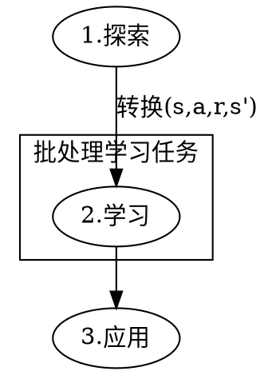
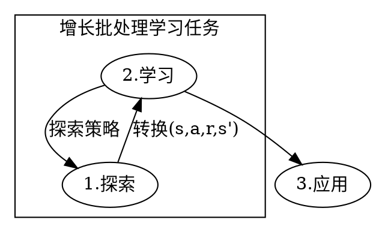

# 马尔可夫决策过程

1.1. 状态
当状态空间的规模为N,环境状态集合为S可以定义为有限集合$S={s_1,s_2,...,s_N}$,即$|S|=N$
对于建模的问题来说,状态是所有信息中唯一的特征.

> 讨论中的状态都是指:
> 离散的状态集合S,且所有属于状态集合S的状态都是合法的.

1.2. 动作
动作集合A可以定义为有限集合$A={a_1,a_2,...,a_K}$,其中,动作空间大小为K,即$|A|=K$
能够应用于某一特征状态$s \in S$的动作集合为$A(s)$,其中$ A(s) \subseteq A$.

> 讨论中的动作都是指:
> 能够运用于每一个状态,即对于每一个状态$s \in S$,都有一个动作集合$A(s)$.这些动作可以通过一个先决条件方程来建模:$S \times A \rightarrow \{true,false\}$
> 即$ A(s)=A$.

1.3. 转换函数
转换函数$T$可以定义为$ S\times A\times S \rightarrow [0,1]$,即作用于状态s的动作结束以后,其概率可以表示为$T(s,a,s')$.
> 通过将动作$a \in A$运用于状态$s \in S$可以得到新的状态$s'\in S$,即$s'=T(s,a)$.
> 如果动作a不能运用于状态s,则对于所有的$s' \in S,T(s,a,s')=0$.

1.4. 奖励方程
奖励方程可以定义为$R:S\rightarrow \mathbb{R}$,或者$R:S\times A\rightarrow \mathbb{R}$,或者$R:S\times A\times S\rightarrow \mathbb{R}$.
> 第一个是给,在一个状态中执行的动作提供奖励
> 第二个和第三个是给,在状态之间的特定转换提供奖励
> 主要使用的是第三个即$R(s,a,s')$

奖励方程是马尔可夫决策过程最重要的部分.因为奖励方程隐式地定义了学习的目标.

1.5. 马尔可夫决策过程
马尔可夫决策过程是一个由4个元素组成的结构$(S,A,T,R)$.其中,S是一个包含所有状态的有限集合,A是一个包含所有动作的有限集合,T是一个定义为$ S\times A\times S \rightarrow [0,1]$的转换函数,R是一个定义为
$R:S\times A\times S\rightarrow \mathbb{R}$的奖励方程.

## 策略

给定一个马尔可夫决策过程$(S,A,T,R)$,对于每一个状态$s \in S$和动作$a \in A$来说,策略是输出$s'$的可计算函数.

其定义为$\pi: S \rightarrow A$.称之为确定性策略
> 或者$\pi: S \times A \rightarrow [0,1]$,即 $\pi(s,a)$,且$\sum \pi(s,a)=1$.称之为随机性策略
> 策略是学习器的一部分,而学习器的目的是控制环境,面环境是用马尔可夫决策过程建模的.
> 一个固定的策略是在马尔可夫决策过程中推导出一个静态转换,而这个表态转换能够转换成马尔可夫决策系统<S',T'>.满足以下条件:当$\pi(s)=a时,S‘=S,T’(s,s')=T'(s,a,s')$.

## 最优准则和减量
前面我们定义了环境(即马尔可夫决策过程)和学习器(即策略).在我们讨论最优算法之前,我们必须定义这意味着什么.也就是说,定义什么是最优模型.
2.1. 如果学习器只关心即时奖励,一个最优准则是优化$E[r_t]$
> t可能的域为,有限时域,无限时域,平均奖励($\lim_{h\rightarrow \infin}E[\frac{1}{h}\sum_hr_t]$)
> 学习最终的结果可能是解释什么是学习最优性.首先要考虑的是学习器是否能够在原则上获得最优性能.换句话说,是否有一种方法可以确保学习过程达到一个全局最优,或仅仅是一个局部最优,甚至是性能在某个区间振荡?第二种最优模型与收敛到一个解决方案的速度有关.
> 我们可以区分两种学习方法,通过寻找有多少相互作用是必要的,或每一个相互作用的计算量是多少.

## 价值函数和贝尔曼方程
* 价值函数
价值函数为特定的策略所定义.在策略$\pi$下的状态S的值表示为$V^\pi(s)$,是预期收益.以无限的时域贴现模型,可以表示为:
$$
V^\pi(s) = E_{\pi}[\sum_{k=0}^{\infin}\gamma^k r_{t+k}|S_t=s]
$$
一个类似的状态-动作价值函数$Q:S\times A\rightarrow\mathbb{R}$可以定义为从状态s出发,采取动作a的期望收益.此后跟随以下策略$\pi$:
$$
Q^\pi(s,a) = E_{\pi}[\sum_{k=0}^{\infin}\gamma^k r_{t+k}|S_t=s,a_t=a]
$$

* 贝尔曼方程
$$
\begin{aligned}
V^\pi(s) &= E_{\pi}[\sum_{k=0}^{\infin}\gamma^k r_{t+k}|S_t=s] \\
 &= E_{\pi}[r_t+\gamma{V^\pi(s_{t+1}) }|S_t=s] \\
 &= \sum_{s'}T(s,\pi(s),s')[R(s,a,s')+\gamma{V^\pi(s')}]
\end{aligned}
$$

* 贪婪策略
记最优策略为$\pi^*$,贪婪策略下有$\pi^*(s) = \argmax_a Q^*(s,a)$.
> $\pi^*(s) = \argmax_a\sum_{s'}T(s,a,s')[R(s,a,s')+\gamma{V^*(s')}]$
> 贪婪策略下,
> $Q^*(s,a) = \sum_{s'}T(s,a,s')[R(s,a,s')+\gamma{\max_{a'}Q^*(s',a')}]$
> Q函数是对不同的选择进行加权求和,此时未必使用转换函数.不需要向前的推理步骤来在状态中计算最优行为.这是无模型方法的原因.即如果T和R未知的,学习的不是V,而是Q.
> 且有$V^*(s)=\max_a{Q^*(s,a)}$

* 迭代策略
  迭代策略生成一个交替的策略和价值函数
  $\pi_0\rightarrow\pi_1\rightarrow\pi_2\rightarrow\cdots\rightarrow\pi^*$
  $\pi_0\rightarrow V^{\pi_0}\rightarrow\pi_1\rightarrow V^{\pi_1}\rightarrow\cdots\rightarrow\pi^*$
> 第一步是策略评估,使用公式来计算$V^{\pi_K}$
> 第二步是策略改进,采用$V^{\pi_K}$来计算$\pi_{k+1}$

## 时序差分学习
时序差分,一个直观的例子描述出下.想象一下,你必须预测客人什么时候来,在烹饪之前,根据那个订单,你必须去超市,肉店,酒庄.你有所有位置之间驾驶时间的估计值,你认为你能设法在最后10分钟内到达目的地.但路上拥堵,你估计去超市要一个半小时.基于这个预测,你必须通知你的客人.

TD学习的主要原则:你不必等到试验结束再沿着你的路径进行更新的.这个方法的优势是,你不必要一个马尔可夫决策过程.
* TD(0):
$$
V_k(s) = V_k(s) + \alpha[R_k(s) + \gamma V_{k+1}(s') - V_{k}(s)]
$$
其中,$\alpha$是学习率.

* Q学习:
Q学习的基本思想是基于奖励(反馈)来更新状态-动作价值函数.
$$
Q_{k+1}(s_t,a_t) = Q_k(s_t,a_t) + \alpha[r_t + \gamma \max_a Q_{k+1}(s_{t+1},a) - Q_k(s_t,a_t)]
$$
从状态$s_t到s_{t+1}$,学习器在环境中在接收奖励$r_t$时,选择动作$a_t$并且更新状态-动作价值函数.
Q学习是探索不敏感的,这意味着Q学习将收敛于最优策略.

2.1. 批处理算法
批处理算法是指从一组固定的已知先验转移样本中学习最佳可能策略的任务.
特别强调在这个领域中开发出来,是为了,能很好的适应,学习器与环境不断交互进行学习.
$$
A^{*}(s)=\max_\mathbb{T}V^\mathbb{T}(s),\mathbb{T}为一组固定的已知先验转移样本T的闭包
$$

* 批处理算法的特点包含以下两个:
1. 处理一批转换,并从中得成最佳转换.
2. 这个集合是不固定的

* 意味着的好处:
1. 所有观察到的转换在整个转换中同时的存储与更新,即拟合.
2. 允许定义“增长批处理”,最大程序减少了批处理和在线学习方法之间的差异.

2.2.1. 批处理学习问题
批处理学习问题中,学习器本身不允许在学习过程中与系统交互.
学习器的作用不是观察状态s,尝试一个动作a并根据接下来的状态s'和奖励r改变策略.学习器本身只接收一个从环境中取得的p个转换的样本(s,a,r,s'),形成集合
$\mathbb{F}=\{(s_t,a_t,r_{t+1},s_{t+1})|t=1,...,p\}$

注意:
1. 探索不是学习的一部分
2. 探索的困难不完全来自于学习问题

2.2.2. 增长批处理学习问题
下图和上图很好的说明了增长批处理学习问题与批处理学习问题的区别.

这类学习问题的特点是:在探索阶段和学习阶段的转换之间来回交换
在文献中,增长批处理方法可以有几种不同的形式.
1. 在探索阶段和学习阶段的转换之间来回交换的次数可以从两次到最大次数
2. 每几次与系统交互,学习器就会更新一次策略

2.3. 批处理强化学习

1. 批处理算法可以在训练过程中自动更新观察到的转换.

好处是:能

批处理算法是指从一组固定的数据集中训练模型，并在这组数据集上测试模型的算法。

数据集中训练模型，并在这组数据集上测试模型的算法。

1.2. 批处理强化学习
批处理强化学习是一种在线学习的方法，它通过将训练数据集分成若干个小的数据集，每个数据集都是一个独立的训练集，然后对每个训练集进行训练，最后将所有训练集的结果进行平均，得到一个最终的结果。

## 分解域
很多问题可以利用一个分解状态来表示,该状态由一个包含n个状态特征的向量表示
$s=<x_0,...,x_n>$

状态空间和一个状态空间的状态空间组成.