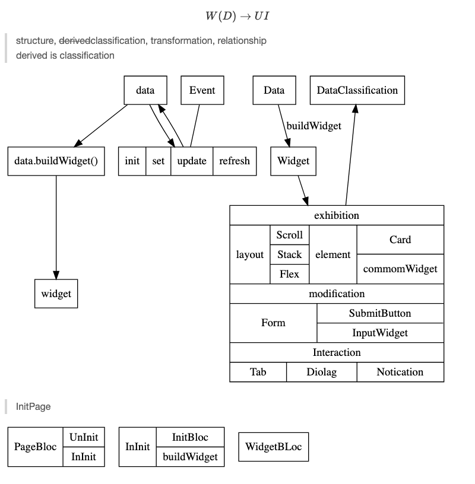

1. For beginner
```
flutter create --template=app [project_name]
flutter run
```
> Some of the problems:
> **vpn**, pod dep, apikey, 证书...

2. Scaffold and MaterialApp
脚手架和Material App 为你做了很多工作，以让你可以直接使用runApp

3. SetState
StatefulWidget 的核心API,但是这个API并不是很好用，有以状态管理(Fish_redux,Bloc,Provider,Riverpod),你将状态与UI分离，理论上,你可以在任何地方更新状态，你可以在任何地方更新UI
> InheritedWidget->InheritedElement
> Builder,
> Stateless element 不会更新,那么相当于剪枝了

4. Listview
优化过的 ScrollView, 里面本质上是sliver(只显示你将看到的部分)

5. SnackBar, Darggable,DragTarget,Form
> 让你的App功能更全面,更好看

6. auto_route
方便的路由(支持navigator2.0的)
> navigator2.0 不是用method来跳转的,而是用Widget+Overlay来跳转

7. layout of Card
小组件的4种布局类型: 360,768,1024,infinity
(横向图文,双列竖向图文,单列Stack(Bg),双列横向图(Bg)文)
> First start from [io_2019_demos](https://github.com/material-components/material-components-flutter-experimental/tree/develop/io_2019_demos/lib/fortnightly)

8. Some of messy
* year 2019

> now api is binding to schema. Cool!
* fluent_ui maybe future.
1. Uniform UI Safe time
2. many likes,usednesses.

* some wonderful UI repo
https://github.com/gskinnerTeam/flokk/

https://github.com/flutter/gallery/

https://github.com/gskinnerTeam#:~:text=783-,flutter%2Dfolio,-Public

https://github.com/gskinnerTeam/flutter_vignettes

> gskinner is a team cooperation with google on 2019
* rust instead c maybe better.
> with crate, ffi, You would safe time and performance.

9. resources
https://resocoder.com/
> study package from 2019 to now.