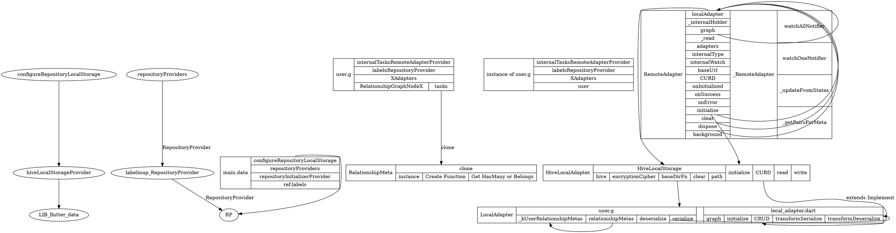

# graph of FD



* Repository.watchOneNotifier
> watch(model)->watchOne(model, remote: false).model!
> in class _RemoteAdapterWatch.watchOneNotifier,
> step1, prepare some args like {id,_finder,label,_getUpdatedModel}
>> _finder Callback
>> label DataRequestLabel('watchOne' ... findAll/reports@b5d14c
>>> DataModel.Relationship=b5d14c
>>> localAdapter.findOne(key) get some RDataModel
>> _getUpdatedModel Funtion
```dart
@protected
  DataStateNotifier<T?> watchOneNotifier(
    String key, {
    bool? remote,
    Map<String, dynamic>? params,
    Map<String, String>? headers,
    AlsoWatch<T>? alsoWatch,
    String? finder,
    DataRequestLabel? label,
  }) {
    final id = graph.getIdForKey(key);

    remote ??= _remote;
    final _maybeFinder = _internalHolder?.finders[finder]?.call(this);
    final _finder = _maybeFinder is DataFinderOne<T> ? _maybeFinder : findOne;

    // we can't use `findOne`'s default internal label
    // because we need a label to handle events
    label ??=
        DataRequestLabel('watchOne', id: key.detypify(), type: internalType);

    var _alsoWatchPairs = <List<String>>{};

    // closure to get latest model and watchable relationship pairs
    T? _getUpdatedModel({DataStateNotifier<T?>? withNotifier}) {
      final model = localAdapter.findOne(key);
      if (model != null) {
        // get all metas provided via `alsoWatch`
        final metas = alsoWatch
            ?.call(RelationshipGraphNode<T>())
            .whereType<RelationshipMeta>();

        // recursively get applicable watch key pairs for each meta -
        // from top to bottom (e.g. `p`, `p.familia`, `p.familia.cottage`)
        _alsoWatchPairs = {
          ...?metas
              ?.map((meta) => _getPairsForMeta(meta._top, model))
              .filterNulls
              .expand((_) => _)
        };
        if (withNotifier != null) {
          model._updateNotifier(withNotifier);
        }
      } else {
        // if there is no model nothing should be watched, reset pairs
        _alsoWatchPairs = {};
      }
      return model;
    }

    final _notifier = DataStateNotifier<T?>(
      data: DataState(_getUpdatedModel(), isLoading: remote!),
    );

    log(label,
        'initializing${alsoWatch != null ? ' (with relationships)' : ''}');

    _notifier._reloadFn = () async {
      if (!_notifier.mounted || id == null) return;

      if (remote!) {
        _notifier.updateWith(isLoading: true);
      }

      final model = await _finder(
        id,
        remote: remote,
        params: params,
        headers: headers,
        label: label,
        onError: (e, label, _) async {
          try {
            await onError<T>(e, label);
          } on DataException catch (err) {
            e = err;
          } catch (_) {
            rethrow;
          }
          if (_notifier.mounted) {
            _notifier.updateWith(isLoading: false, exception: e);
          }
          return null;
        },
      );
      // trigger doneLoading to ensure state is updated with isLoading=false
      final _key = model?._key;
      if (remote && _key != null) {
        graph._notify([_key, label.toString()],
            type: DataGraphEventType.doneLoading);
      }
    };

    // trigger local + async loading
    _notifier.reload();

    // local buffer useful to reduce amount of notifier updates
    var _model = _notifier.data.model;

    late DelayedStateNotifier<List<DataGraphEvent>> _graph;

    final throttleDuration = read(graphNotifierThrottleDurationProvider);
    if (throttleDuration != null) {
      _graph = graph.throttle(() => throttleDuration);
    } else {
      // if no throttle is required, use map to
      // convert a single event in a list of events
      _graph = graph.map((_) => [_]);
    }

    final _states = <DataState<T?>>[];

    // start listening to graph for further changes
    final _dispose = _graph.addListener((events) {
      if (!_notifier.mounted) return;

      final _key = _model?._key ?? key;

      // get the latest updated model with watchable relationships
      // (_alsoWatchPairs) in order to determine whether there is
      // something that will cause an event (with the introduction
      // of `andEach` even seemingly unrelated models could trigger)
      _model = _getUpdatedModel(withNotifier: _notifier);

      for (final event in events) {
        if (event.keys.contains(_key)) {
          // handle done loading
          if (_notifier.data.isLoading &&
              event.keys.last == label.toString() &&
              event.type == DataGraphEventType.doneLoading) {
            _states.add(DataState(_model, isLoading: false, exception: null));
          }

          // add/update
          if (event.type == DataGraphEventType.addNode ||
              event.type == DataGraphEventType.updateNode) {
            if (_notifier.data.isLoading == false) {
              log(label!, 'added/updated node ${event.keys}', logLevel: 2);
              _states.add(DataState(
                _model,
                isLoading: _notifier.data.isLoading,
                exception: _notifier.data.exception,
                stackTrace: _notifier.data.stackTrace,
              ));
            }
          }

          // temporarily restore removed pair so that watchedRelationshipUpdate
          // has a chance to apply the update
          if (event.type == DataGraphEventType.removeEdge &&
              !event.keys.first.startsWith('id:')) {
            _alsoWatchPairs.add(event.keys);
          }
        }

        // handle deletion
        if (event.type == DataGraphEventType.removeNode && _model == null) {
          log(label!, 'removed node ${event.keys}', logLevel: 2);
          _states.add(DataState(
            null,
            isLoading: _notifier.data.isLoading,
            exception: _notifier.data.exception,
            stackTrace: _notifier.data.stackTrace,
          ));
        }

        // updates on watched relationships condition
        final watchedRelationshipUpdate = event.type.isEdge &&
            _alsoWatchPairs
                .where((pair) =>
                    pair.sorted().toString() == event.keys.sorted().toString())
                .isNotEmpty;

        // updates on watched models (of relationships) condition
        final watchedModelUpdate = event.type.isNode &&
            _alsoWatchPairs
                .where((pair) => pair.contains(event.keys.first))
                .isNotEmpty;

        // if model is loaded and any condition passes, notify update
        if (_notifier.data.isLoading == false &&
            (watchedRelationshipUpdate || watchedModelUpdate)) {
          log(label!, 'relationship update ${event.keys}', logLevel: 2);
          _states.add(DataState(
            _model,
            isLoading: _notifier.data.isLoading,
            exception: _notifier.data.exception,
            stackTrace: _notifier.data.stackTrace,
          ));
        }
      }

      _updateFromStates(_states, _notifier);
    });

    _notifier.onDispose = () {
      log(label!, 'disposing');
      _dispose();
    };
    return _notifier;
  }
```

* meta.clone
```dart
RelationshipMeta<T> clone({RelationshipMeta? parent}) {
final meta = RelationshipMeta<T>(
    name: name,
    type: type,
    kind: kind,
    instance: instance,
);
if (parent != null) {
    meta.parent = parent;
    meta.parent!.child = meta; // automatically set child
}
return meta;
}
```

* transformSerialize
```dart
Map<String, dynamic> transformSerialize(Map<String, dynamic> map,
    {bool withRelationships = true}) {
for (final e in relationshipMetas.entries) {
    final key = e.key;
    if (withRelationships) {
    final ignored = e.value.serialize == false;
    if (ignored) map.remove(key);

    if (map[key] is HasMany) {
        map[key] = (map[key] as HasMany).keys;
    } else if (map[key] is BelongsTo) {
        map[key] = map[key].key;
    }

    if (map[key] == null) map.remove(key);
    } else {
    map.remove(key);
    }
}
return map;
}
```

* relationshipMetas
```dart
static final Map<String, RelationshipMeta> _kUserRelationshipMetas = {
    'tasks': RelationshipMeta<Task>(
      name: 'tasks',
      inverseName: 'user',
      type: 'tasks',
      kind: 'HasMany',
      instance: (_) => (_ as User).tasks,
    )
  };
```
> _initializeRelationships->relationship?.initialize(..,metatdata..,..)
```dart
Map<String, Relationship> getRelationships() {
    return {
      for (final meta in remoteAdapter.localAdapter.relationshipMetas.values)
        if (meta.instance(this) != null) meta.name: meta.instance(this)!,
    };
  }
```

* hiveLocalStorageProvider
```dart
final hiveLocalStorageProvider = Provider<HiveLocalStorage>((ref) =>
    HiveLocalStorage(hive: ref.read(hiveProvider), baseDirFn: () => ''));
```


* RemoteAdapter.initialize
```dart
  @mustCallSuper
  @nonVirtual
  Future<RemoteAdapter<T>> initialize(
      {bool? remote,
      required Map<String, RemoteAdapter> adapters,
      required Reader read}) async {
    if (isInitialized) return this as RemoteAdapter<T>;

    // initialize attributes
    _adapters = adapters;
    _remote = remote ?? true;
    _read = read;

    await localAdapter.initialize(); ///HiveLocalAdapter.initialize

    // hook for clients
    await onInitialized(); ///graph.removeOrphanNodes()

    return this as RemoteAdapter<T>;
  }
```

* RemoteAdapter.findAll
```dart
Future<List<T>?> findAll({
    bool? remote,
    bool? background,
    Map<String, dynamic>? params,
    Map<String, String>? headers,
    bool? syncLocal,
    OnSuccessAll<T>? onSuccess,
    OnErrorAll<T>? onError,
    DataRequestLabel? label,
  }) async {
    remote ??= _remote;
    background ??= false;
    syncLocal ??= false;
    params = await defaultParams & params;
    headers = await defaultHeaders & headers;

    label = DataRequestLabel('findAll', type: internalType, withParent: label);

    late List<T>? models;
    /// if remote is false, just use local data
    if (!shouldLoadRemoteAll(remote!, params, headers) || background) {
      models = localAdapter.findAll()?.toImmutableList();
      if (models != null) {
        log(label,
            'returned ${models.toShortLog()} from local storage${background ? ' and loading in the background' : ''}');
      }
      if (!background) {
        return models;
      }
    }

    log(label, 'request ${params.isNotEmpty ? 'with $params' : ''}');

    final future = sendRequest<List<T>>(
      baseUrl.asUri / urlForFindAll(params) & params,
      method: methodForFindAll(params),
      headers: headers,
      label: label,
      /// just return Future<T>
      onSuccess: (data, label) async {
        if (syncLocal!) {
          await localAdapter.clear();
        }
        onSuccess ??= (data, label, _) => this.onSuccess<List<T>>(data, label);
        return onSuccess!.call(data, label, this as RemoteAdapter<T>);
      },
      onError: (e, label) async {
        onError ??= (e, label, _) => this.onError<List<T>>(e, label);
        return onError!.call(e, label, this as RemoteAdapter<T>);
      },
    );

    if (background && models != null) {
      // ignore: unawaited_futures
      future.then((_) => Future.value(_));
      return models;
    } else {
      return await future ?? <T>[];
    }
  }
```

* RemoteAdapter.onSuccess
  just return FutureOr<R?> and save to local
```dart
FutureOr<R?> onSuccess<R>(Object? data, DataRequestLabel? label) async {
    // remove all operations with this label
    OfflineOperation.remove(label!, this as RemoteAdapter);

    if (label.kind == 'save') {
      if (label.model == null) {
        return null;
      }
      var model = label.model as T;

      if (data == null) {
        // return original model if response was empty
        return model as R?;
      }

      // deserialize already inits models
      // if model had a key already, reuse it
      final deserialized = await deserialize(data as Map<String, dynamic>);
      model = deserialized.model!.was(model).saveLocal();

      log(label, 'saved in local storage and remote');
      return model as R?;
    }

    if (label.kind == 'delete') {
      log(label, 'deleted in local storage and remote');
      return null;
    }

    final deserialized = await deserialize(data);
    deserialized._log(this as RemoteAdapter, label);

    final isFindAll = label.kind.startsWith('findAll');
    final isFindOne = label.kind.startsWith('findOne');
    final isCustom = label.kind == 'custom';

    if (isFindAll || (isCustom && deserialized.model == null)) {
      for (final model in [...deserialized.models, ...deserialized.included]) {
        model.saveLocal();
      }
      return deserialized.models as R?;
    }

    if (isFindOne || (isCustom && deserialized.model != null)) {
      for (final model in [...deserialized.models, ...deserialized.included]) {
        model.saveLocal();
      }
      return deserialized.model as R?;
    }

    return null;
  }
```

* RemoteAdapter
```dart
@override
void dispose() {
    localAdapter.dispose();
}

background

```