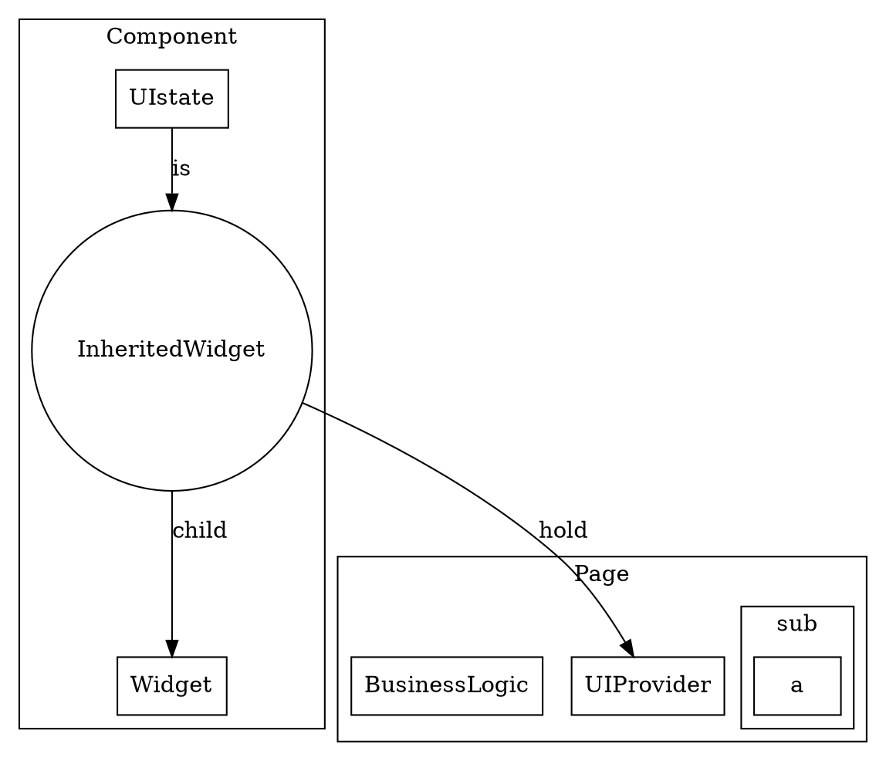

```
# run under /lib
mkdir plugin store route util compnents page
mkdir config res
mkdir mock
cd store
mkdir beans data_provider repository bloc presentation
cd ..

cd config
touch constanst.dart
cd ..
cd res
touch color.dart theme.dart 
cd ..

cd .. #root
mkdir locale res readme docs #assets
```

## 1.描述界面而不要操作界面
## 2.基于共同祖先通信
数据上行，通知下行
## 函数式数据流
rxdart+stream
## 网络上的闲鱼早期结构



1. uiState 
uiState is a part of component, and it would change by something. 
I think it is just a data.so using inherited, make data up.
2. 