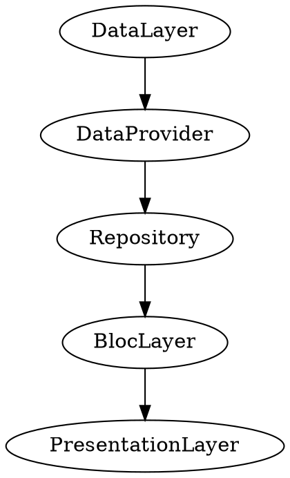
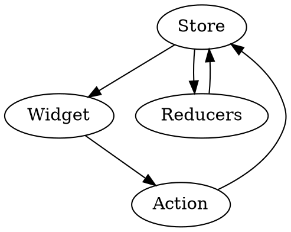
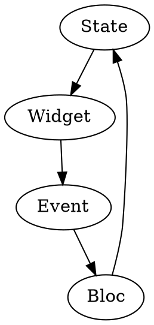

# BLoc

# introduction
1. what's bloc?
`business` and `logic` of componet
2. install
```yaml
dependencies:
  bloc: ^2.0.0
  flutter_bloc: ^2.0.0
  sealed_flutter_bloc: ^2.0.0
  hydrated_bloc: ^2.0.0
  
```
3. import
```dart
import 'package:bloc/bloc.dart';
import 'package:flutter_bloc/flutter_bloc.dart';
import 'package:sealed_flutter_bloc/sealed_flutter_bloc.dart';
import 'package:hydrated_bloc/hydrated_bloc.dart';

```
4. why
Simple
* Easy to understand & can be used by developers with varying skill levels.
Powerful
* Help make amazing, complex applications by composing them of smaller components.
Testable
* Easily test every aspect of an application so that we can iterate with confidence.

> other
* know what state our application is in at any point in time
* record every single user interaction in our application so that we can make data-driven decisions.
* within a single code base following the same patterns
* develop fast and reactive apps.

# articheture


> The repository layer is a wrapper around one or more data providers with which the Bloc Layer communicates.
> BlocLayer is Logic

# Test
```dart
enum CounterEvent { increment, decrement }

class CounterBloc extends Bloc<CounterEvent, int> {
  @override
  int get initialState => 0;

  @override
  Stream<int> mapEventToState(CounterEvent event) async* {
    switch (event) {
      case CounterEvent.decrement:
        yield state - 1;
        break;
      case CounterEvent.increment:
        yield state + 1;
        break;
    }
  }
}

group('CounterBloc', () {
    CounterBloc counterBloc;

    setUp(() {
        counterBloc = CounterBloc();
    });

    test('initial state is 0', () {
        expect(counterBloc.initialState, 0);
    });
});

test('single Increment event updates state to 1', () {
    final List<int> expected = [0, 1];

    expectLater(
        counterBloc,
        emitsInOrder(expected),
    );

    counterBloc.add(CounterEvent.increment);
});

test('single Decrement event updates state to -1', () {
    final List<int> expected = [0, -1];

    expectLater(
        counterBloc,
        emitsInOrder(expected),
    );

    counterBloc.add(CounterEvent.decrement);
});

```




> Use Case是简单理解就是响应一个Request的处理过程

> (previousState,action)->(newState)

## 网络上的闲鱼早期结构


> Domain层的能力也是有两个层次的，一个是Domain Service这是相对比较粗的粒度，另一个是Domain的Model这个是最细粒度的复用

> 不知道放哪的放DS

