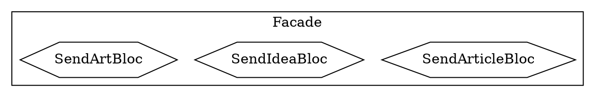
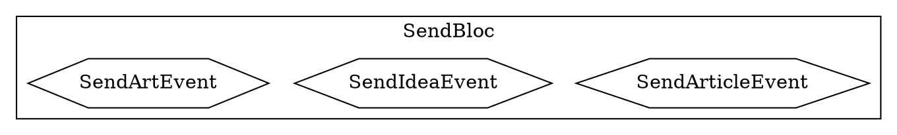
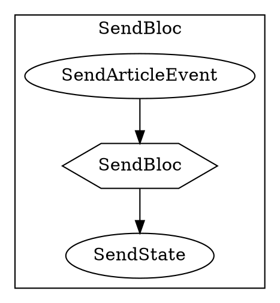
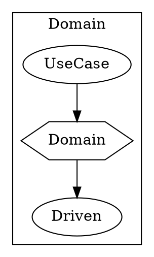

# application

bloc facade ACL

> Bloc.event,Bloc.State 不能调用Bloc

> Bloc 是 一个边界的概念
> x->f->y

> time->   space

# Domain
aggregate domain ACL

> 不能有UseCase调用Domain

# Query
...

GroupSendButton-> GroupToggleBloc ->
GroupArticleSendButton-> GroupArticleSendEvent -> GroupArticleSendBloc
-> NaviationState

end

ArticleEditStory->SendButton->SendEvent->SendBloc->
(SendUseCase)->SendDomain->SendUseDriven->
SuccessBloc.SendSuccessEvent -> SuccessBloc->ToastState,didSuccessEvent->PopState

