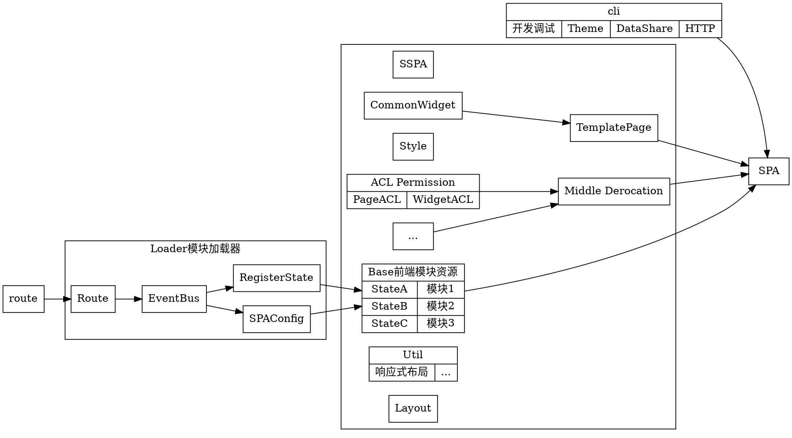

# single-spa dart

1. Route is from cloudConfig? SPAConfig is from cloudConfig. AppPackage version is about resourece
2. RegisterStates is in MatrialApp
3. Midle have many middle, like Permission...
4. There are UUID and some info to make EventBus to log and config Middle
5. SPA is from 基本物料，HTTP生命期响应骨架，物料洋葱层，开发工具